# 성식당

## 프로젝트명 (서비스명) : 성식당 (sungchef)

### 😋 3가지 추천 알고리즘으로 집밥 메뉴를 추천받아보세요

### 🧑‍🍳 검색어 자동완성과 함께 메뉴를 검색해보세요

### 🔥 영수증 OCR 기반으로 냉장고에 재료를 등록해보세요

### 🍴 단계별로 레시피를 들으며 요리해보세요

## 개발 환경

### Android

IDE
- Android Studio Hedgehog 2023.1.1 Patch2

Version
- kotlin: 1.9.0
- JDK : jbr-17 jetbrains Runtime version 17.0.7

### 📖 Android 라이브러리 및 외부 API 사용
|Name|Version|License|
|------|---|---|
|Glide|compose:1.0.0-beta01|Apache License 2.0|
|Retrofit2|2.9.0|Apache License 2.0|
|okhttp3|4.12.0 |Apache License 2.0|
|Hilt|2.49 |Apache License 2.0|
|Room|2.5.2|Apache License 2.0|
|navigation|navigation-compose:2.7.7|Apache License 2.0|
|paging|paging-compose:3.3.0-alpha04 |Apache License 2.0|
|viewmodel|lifecycle-viewmodel-compose:2.7.0|Apache License 2.0|
|Datastore|datastore-preferences:1.0.0|Apache License 2.0|
|Lottie|lottie-compose:6.4.0|MIT License|
|Kakao Login|v2-user:2.20.1||
|Naver Login|oauth-jdk8:5.9.0||

### Server

IDE
- IntelliJ IDEA 2023.3.2
- IntelliJ Community Edition 2023.3

Version
- Java17
- Gradle 8.6
- SpringBoot 3.2.3

### 📖 BackEnd 라이브러리
- Spring Boot
- Spring Security & JWT
- JPA & Hibernate
- AWS
- Jasypt

### Data analysis

IDE
- Visual Studio Code 1.85.1

Version
- python 3.8.10
- hadoop 3.2.4
- spark 3.2.4-bin-hadoop3.2
- zeppelin 0.10.1
- zookeeper 3.8.4
- Django 4.2.11

## 아키텍처
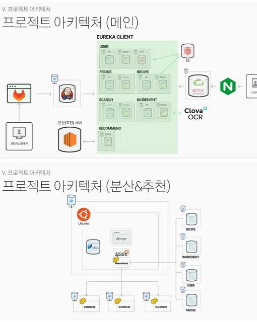

## ERD 다이어그램

## 기술 스택
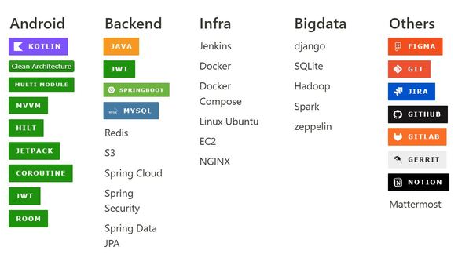

## 추천 시스템 

### 로그 기반 음식 추천
각 음식 마다 “ 요리방식, 메인재료, 부재료1, 부재료2, 부재료3 … “의 형태에서 같은 것이 얼마나 있는지를 기준으로 유사도를 계산한다. 

그런데 이렇게 되면 메인재료와 요리방식이 겹치는 음식과 부재료 2개(예를 들면 소금, 후추)가 같은 음식의 유사도를 같게 된다. 그래서 각 단어에 가중치가 있어야 된다고 생각했다. 

이를 위해서 모든 단어를 TF-IDF 변환해주었다. TF-IDF는 단어들마다 중요한 정도에 따라서 가중치를 부여하는 방법이다. 

모든 문서에서 등장하는 단어는, 중요도가 낮으며 특정 문서에서만 자주 등장하는 단어는 중요도가 높다.
이를 이용해서 요리방식, 메인재료, 부재료들 각각에 가중치를 주어 추천 할 수 있게 되었다.

### 유저 설문 기반 음식 추천 (유저 기반 협업 필터링)
협업 필터링은 제품에 대한 유저의 평가나 행동에 의존하여 추천하게 된다. 

새로운 유저의 경우 제품을 이용한 기록, 평점, 좋아요 등 행동에 대한 기록이 전혀 없기 때문에 협업 필터링 추천시스템은 cold start 문제에 매우 민감하게 반응한다. 

이를 해결하기 위해 회원가입시 유저에게 취향 설문조사를 받았다. 그리고 처음 서비스가 배포되었을 때 유저 데이터가 충분히 쌓이지 않아 비슷한 유저를 찾을 수 없는 문제가 있다. 

이를 해결하기 위해 음식 커뮤니티(만개의 레시피)의 유저와 그 유저의 음식 후기 데이터를 크롤링하여 이 문제를 해결하여 유저기반 협업 필터링의 추천을 구현하였다.

### 냉장고 재료 기반 음식 추천
기본은 첫번째의 로그 기반 추천과 매우 비슷하다. 각 음식은 “ 재료1, 재료2, 재료3 … “ 형태로 유저 냉장고 재료도 “재료1, 재료2, 재료3 ….” 형태로 만들어주고 냉장고의 재료와 음식의 재료 간의 유사도가 가장 높은 음식을 추천해준다. 

이를 위해 모든 음식의 모든 재료에 대한 전처리를 할 필요가 있었다. “감자”, “감자 작은것”, “감자 (중)”, “중간 크기 감자”, “감자中”, “중간크기 감자”를 모두 감자로 통일해 주었다.

## 주요 기능

### 회원 가입
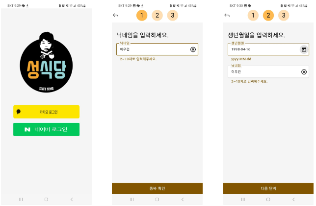
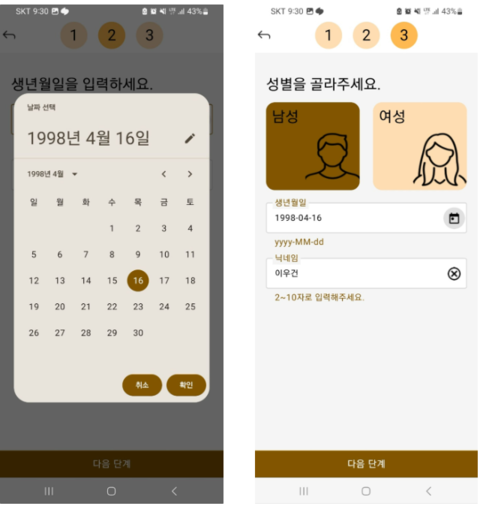

> 로그인, 회원가입 페이지 입니다. 카카오, 네이버 소셜 로그인으로 구현하였으며 Jwt Token 유무로 서버에서 Http 404 code를 받을 시 회원가입 페이지로 이동합니다. 회원가입에서 받는 정보는 닉네임, 생년월일, 성별 입니다.

### 설문하기 & 마이페이지
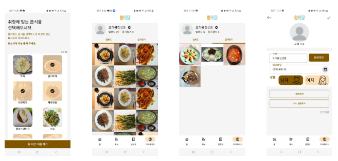

> 설문하기, 마이페이지 입니다. 설문조사 데이터는 음식 추천 로직에 사용됩니다. 마이페이지는 사용자가 음식을 업로드하거나 즐겨찾기한 목록을 볼 수 있습니다.

### 메인 화면
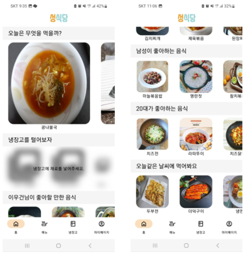

> 메인 화면 입니다. 사용자의 로그 기반, 설문 조사 기반, 냉장고 재료 기반으로 음식을 추천합니다.

### 검색 기능 / 메뉴 화면
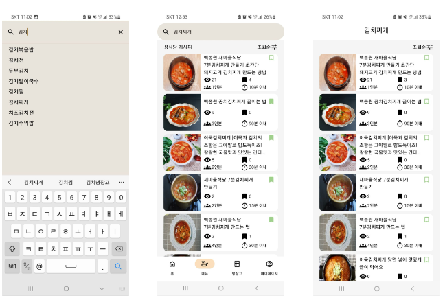
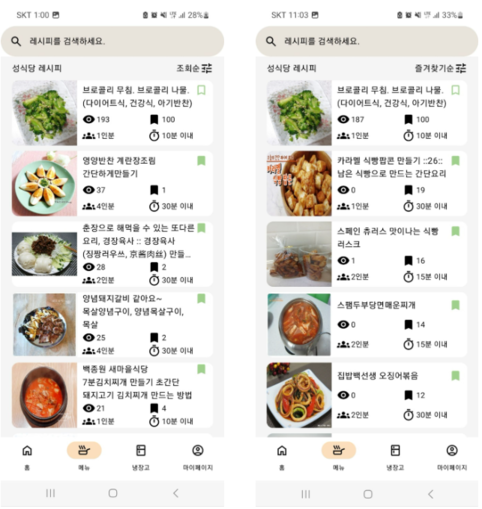

> 메뉴 페이지 및 검색 기능 입니다. 사용자는 음식을 검색 할 수 있고 즐겨찾기 등록을 할 수 있습니다. 기본 메뉴 페이지는 모든 음식을 보여주며 이를 위해 Paging을 사용하여 무한스크롤을 구현하였습니다.

### 메뉴 상세화면
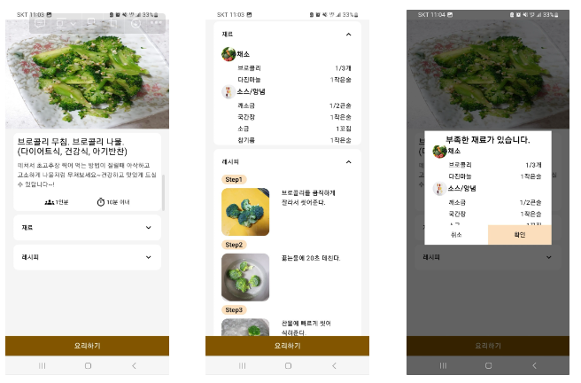

> 메뉴 상세화면 페이지 입니다. 메뉴 화면에서 음식을 클릭할 시 이동합니다. 사용자는 음식의 재료와 레시피를 볼 수 있고 요리를 시작 할 수 있습니다.

### 요리하기 
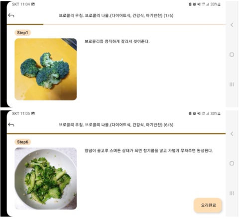

> 요리하기 페이지 입니다. 메뉴 상세화면에서 요리 시작하기 버튼을 클릭 시 이동할 수 있습니다. 사용자의 편의성을 위해 레시피를 TTS로 읽어줍니다.

### 요리 등록하기 / 재료 관리하기
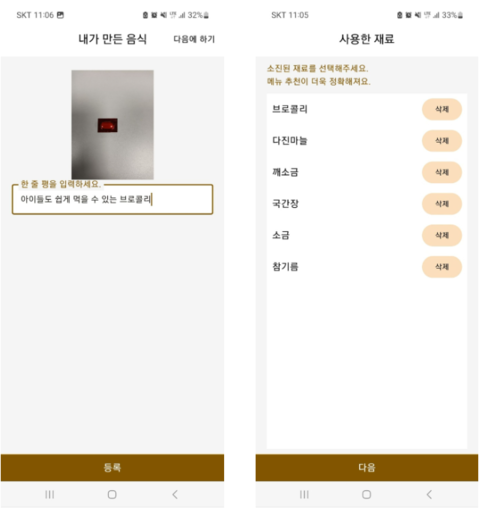

> 요리 등록하기 페이지 입니다. 요리하기 페이지가 끝나면 사용자는 본인의 요리를 등록하고 재료를 관리 할 수 있습니다.

### 냉장고 관리 페이지
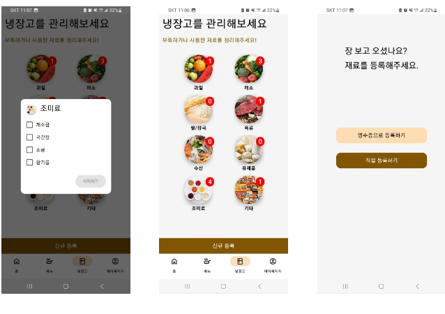
> 냉장고 관리 페이지 입니다. 사용자는 본인의 냉장고 재료를 확인 할 수 있고 요리에 필요한 재료를 등록 할 수 있습니다.

### 냉장고 등록 페이지 (OCR)
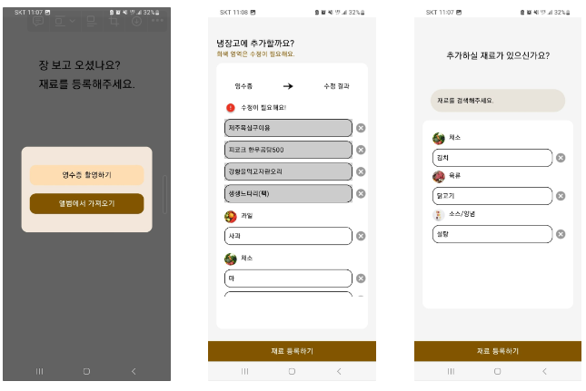
> 냉장고 등록 페이지 입니다. 사용자는 영수증을 촬영하면 OCR 기술로 영수증 내의 재료를 Json으로 변환합니다. 변환된 Json에서 재료를 추출하여 성식당에서 관리하는 재료 DB 테이블과 매핑하여 변환된 값을 나타냅니다. 사용자는 재료를 직접 등록 할 수도 있습니다.

## 팀원 소개
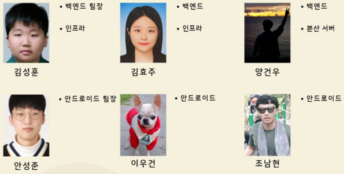
